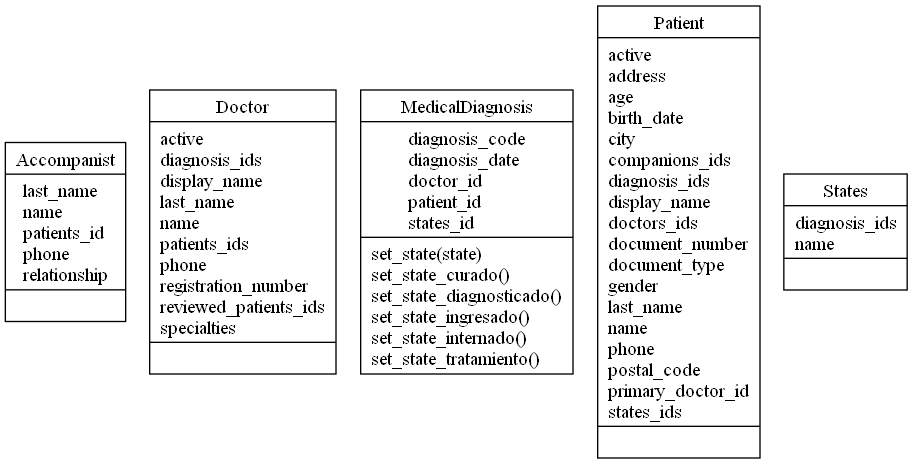
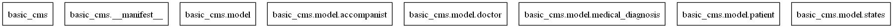

### Odoo 17

## Sistema de Gestión Clínica Médica

### Instalación

Para instalar este módulo, debe:

Descargar el módulo y agregarlo a su carpeta de addons de Odoo. Después, inicie sesión en
su servidor de Odoo y vaya al menú Aplicaciones. Active el modo de depuración y actualice el
lista haciendo clic en el enlace "Actualizar lista de aplicaciones".
Buscar 'basic_cms'. Ahora instale el módulo haciendo clic en el botón de instalación.

### Actualización

Para actualizar este módulo, debe:

Descargar el módulo y agregarlo a su carpeta de complementos de Odoo. Reinicie el servidor
y inicie sesión en su servidor de Odoo. Seleccione el menú Aplicaciones y actualice el módulo haciendo
clic en el botón de actualización.

Opción alternativa:
Puede actualizar el módulo utilizando la línea de comandos.
Vaya a la carpeta de addons de Odoo y ejecute el siguiente comando:
'-u basic_cms'

### Configuración

Es una buena práctica comenzar cargando los profesionales de la salud
y luego los pacientes. 
Luego, puede comenzar a establecer diagnósticos para los pacientes.

### Estructura

basic_cms/
    __init__.py
    __manifest__.py
    models/
        __init__.py
        patient.py
        doctor.py
        medical_diagnosis.py
        states.py
        accompanist.py
    views/
        clinic_general_view.xml
    report/
        patient_report.xml
        patient_template.xml
    static/
        icon.png
    security/
        ir.model.access.csv

### Creditos

* _Agüero Santiago <143agueros@gmail.com>_
